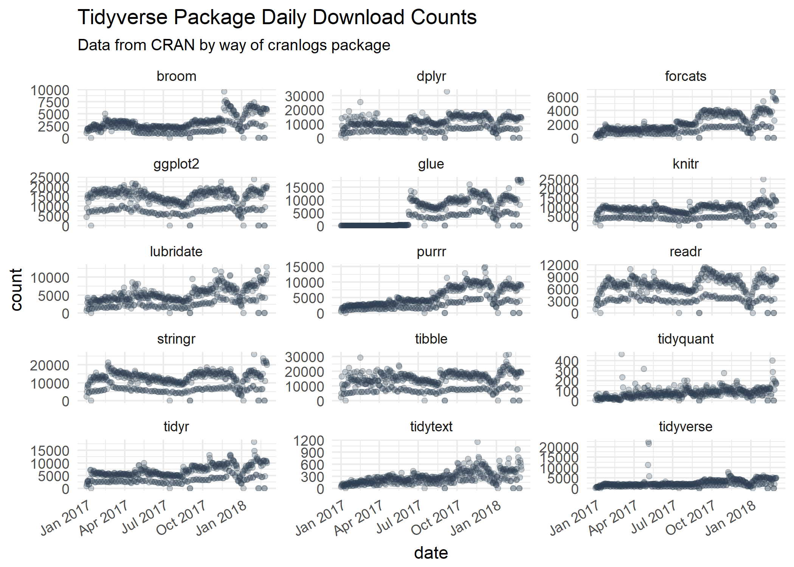

<!-- README.md is generated from README.Rmd. Please edit that file -->

# anomalize 

[](https://travis-ci.org/business-science/anomalize)
[](https://codecov.io/github/business-science/anomalize?branch=master)
[](https://cran.r-project.org/package=anomalize)


> Tidy anomaly detection

`anomalize` enables a tidy workflow for detecting anomalies in data. The
main functions are `time_decompose()`, `anomalize()`, and
`time_recompose()`. When combined, it’s quite simple to decompose time
series, detect anomalies, and create bands separating the “normal” data
from the anomalous
data.

## Anomalize In 2 Minutes (YouTube)

<a href="https://www.youtube.com/watch?v=Gk_HwjhlQJs" target="_blank"></a>

Check out our entire [Software Intro
Series](https://www.youtube.com/watch?v=Gk_HwjhlQJs&list=PLo32uKohmrXsYNhpdwr15W143rX6uMAze)
on YouTube\!

## Installation

You can install the development version with `devtools` or the most
recent CRAN version with `install.packages()`:

``` r
# devtools::install_github("business-science/anomalize")
install.packages("anomalize")
```

## How It Works

`anomalize` has three main functions:

  - `time_decompose()`: Separates the time series into seasonal, trend,
    and remainder components
  - `anomalize()`: Applies anomaly detection methods to the remainder
    component.
  - `time_recompose()`: Calculates limits that separate the “normal”
    data from the anomalies\!

## Getting Started

Load the `tidyverse` and `anomalize` packages.

``` r
library(tidyverse)
library(anomalize)
```

Next, let’s get some data. `anomalize` ships with a data set called
`tidyverse_cran_downloads` that contains the daily CRAN download counts
for 15 “tidy” packages from 2017-01-01 to 2018-03-01.

``` r
tidyverse_cran_downloads %>%
    ggplot(aes(date, count)) +
    geom_point(color = "#2c3e50", alpha = 0.25) +
    facet_wrap(~ package, scale = "free_y", ncol = 3) +
    theme_minimal() +
    theme(axis.text.x = element_text(angle = 30, hjust = 1)) +
    labs(title = "Tidyverse Package Daily Download Counts",
         subtitle = "Data from CRAN by way of cranlogs package")
```



Suppose we want to determine which daily download “counts” are
anomalous. It’s as easy as using the three main functions
(`time_decompose()`, `anomalize()`, and `time_recompose()`) along with a
visualization function, `plot_anomalies()`.

``` r
tidyverse_cran_downloads %>%
    # Data Manipulation / Anomaly Detection
    time_decompose(count, method = "stl") %>%
    anomalize(remainder, method = "iqr") %>%
    time_recompose() %>%
    # Anomaly Visualization
    plot_anomalies(time_recomposed = TRUE, ncol = 3, alpha_dots = 0.25) +
    labs(title = "Tidyverse Anomalies", subtitle = "STL + IQR Methods") 
```


If you’re familiar with Twitter’s `AnomalyDetection` package, you can
implement that method by combining `time_decompose(method = "twitter")`
with `anomalize(method = "gesd")`. Additionally, we’ll adjust the `trend
= "2 months"` to adjust the median spans, which is how Twitter’s
decomposition method works.

``` r
# Get only lubridate downloads
lubridate_dloads <- tidyverse_cran_downloads %>%
    filter(package == "lubridate") %>% 
    ungroup()

# Anomalize!!
lubridate_dloads %>%
    # Twitter + GESD
    time_decompose(count, method = "twitter", trend = "2 months") %>%
    anomalize(remainder, method = "gesd") %>%
    time_recompose() %>%
    # Anomaly Visualziation
    plot_anomalies(time_recomposed = TRUE) +
    labs(title = "Lubridate Anomalies", subtitle = "Twitter + GESD Methods")
```


Last, we can compare to STL + IQR methods, which use different
decomposition and anomaly detection approaches.

``` r
lubridate_dloads %>%
    # STL + IQR Anomaly Detection
    time_decompose(count, method = "stl", trend = "2 months") %>%
    anomalize(remainder, method = "iqr") %>%
    time_recompose() %>%
    # Anomaly Visualization
    plot_anomalies(time_recomposed = TRUE) +
    labs(title = "Lubridate Anomalies", subtitle = "STL + IQR Methods")
```


## Reducing Forecast Error by 32%

Yes\! Anomalize has a new function, `clean_anomalies()`, that can be
used to repair time series prior to forecasting. We have a [brand new
vignette - Reduce Forecast Error (by 32%) with Cleaned
Anomalies](https://business-science.github.io/anomalize/articles/forecasting_with_cleaned_anomalies.html).

``` r
tidyverse_cran_downloads %>%
    filter(package == "lubridate") %>%
    ungroup() %>%
    time_decompose(count) %>%
    anomalize(remainder) %>%
  
    # New function that cleans & repairs anomalies!
    clean_anomalies() %>%
  
    select(date, observed, observed_cleaned) %>%
    
    ggplot(aes(date, observed)) +
    geom_point(color = palette_light()["blue"], alpha = 0.5) +
    geom_point(aes(y = observed_cleaned), color = palette_light()["red"], alpha = 0.5) +
    labs(title = "Cleaning Anomalies", subtitle = "Red has anomalies repaired by clean_anomalies()")
```


## But Wait, There’s More\!

There are a several extra capabilities:

  - `plot_anomaly_decomposition()` for visualizing the inner workings of
    how algorithm detects anomalies in the “remainder”.

<!-- end list -->

``` r
tidyverse_cran_downloads %>%
    filter(package == "lubridate") %>%
    ungroup() %>%
    time_decompose(count) %>%
    anomalize(remainder) %>%
    plot_anomaly_decomposition() +
    labs(title = "Decomposition of Anomalized Lubridate Downloads")
```


## References

Several other packages were instrumental in developing anomaly detection
methods used in `anomalize`:

  - Twitter’s `AnomalyDetection`, which implements decomposition using
    median spans and the Generalized Extreme Studentized Deviation
    (GESD) test for anomalies.
  - `forecast::tsoutliers()` function, which implements the IQR method.

# Interested in Learning Anomaly Detection?

Business Science offers two 1-hour courses on Anomaly Detection:

  - [Learning
    Lab 18](https://university.business-science.io/p/learning-labs-pro)
    - Time Series Anomaly Detection with `anomalize`

  - [Learning
    Lab 17](https://university.business-science.io/p/learning-labs-pro)
    - Anomaly Detection with `H2O` Machine Learning
