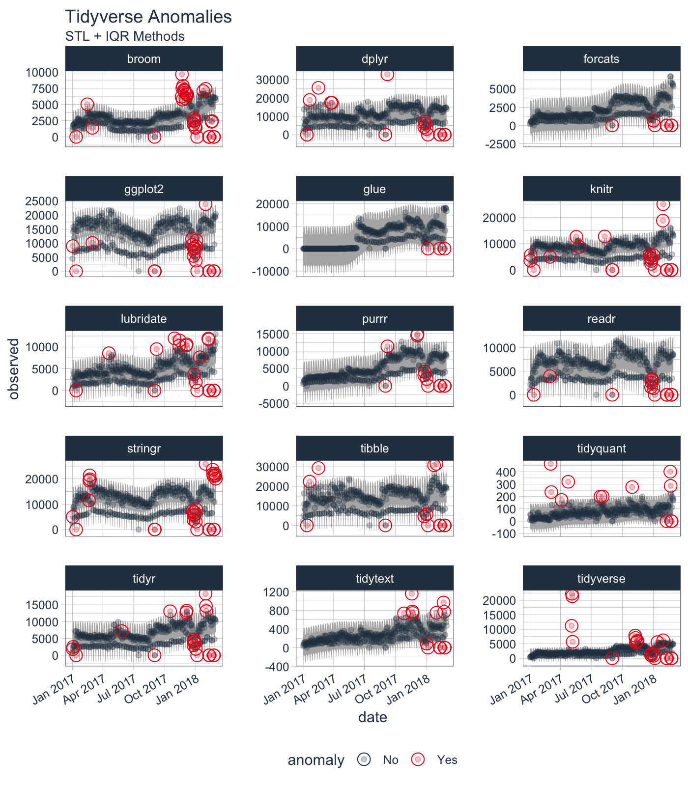
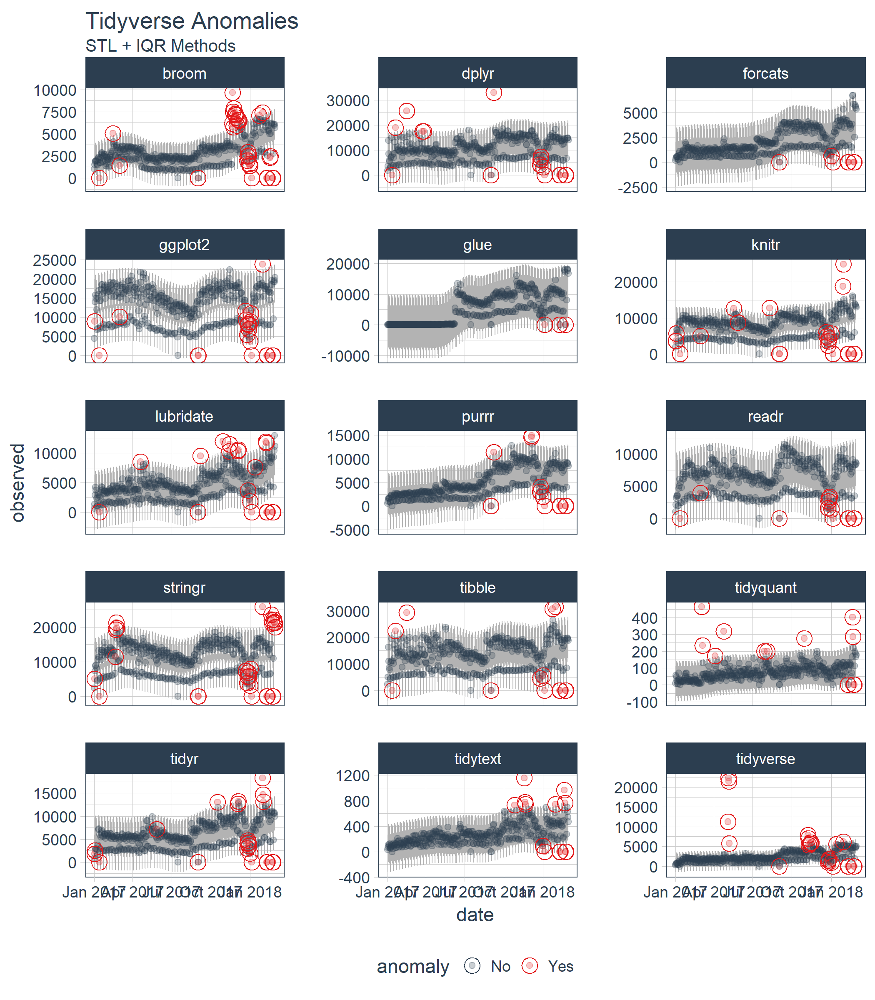

<!-- README.md is generated from README.Rmd. Please edit that file -->

# Anomalize is being Superceded by Timetk:

The `anomalize` package functionality has been superceded by `timetk`.
We suggest you begin to use the `timetk::anomalize()` to benefit from
enhanced functionality to get improvements going forward. [Learn more
about Anomaly Detection with `timetk`
here.](https://business-science.github.io/timetk/articles/TK08_Automatic_Anomaly_Detection.html)

The original `anomalize` package functionality will be maintained for
previous code bases that use the legacy functionality.

To prevent the new `timetk` functionality from conflicting with old
`anomalize` code, use these lines:

``` r
library(anomalize)

anomalize <- anomalize::anomalize
plot_anomalies <- anomalize::plot_anomalies
```

<!-- # anomalize -->

# anomalize 

[](https://app.codecov.io/github/business-science/anomalize?branch=master)
[](https://cran.r-project.org/package=anomalize)


> Tidy anomaly detection

`anomalize` enables a tidy workflow for detecting anomalies in data. The
main functions are `time_decompose()`, `anomalize()`, and
`time_recompose()`. When combined, it’s quite simple to decompose time
series, detect anomalies, and create bands separating the “normal” data
from the anomalous data.

## Anomalize In 2 Minutes (YouTube)

<a href="https://www.youtube.com/watch?v=Gk_HwjhlQJs" target="_blank"></a>

Check out our entire [Software Intro
Series](https://www.youtube.com/watch?v=Gk_HwjhlQJs&list=PLo32uKohmrXsYNhpdwr15W143rX6uMAze)
on YouTube!

## Installation

You can install the development version with `devtools` or the most
recent CRAN version with `install.packages()`:

``` r
# devtools::install_github("business-science/anomalize")
install.packages("anomalize")
```

## How It Works

`anomalize` has three main functions:

- `time_decompose()`: Separates the time series into seasonal, trend,
  and remainder components
- `anomalize()`: Applies anomaly detection methods to the remainder
  component.
- `time_recompose()`: Calculates limits that separate the “normal” data
  from the anomalies!

## Getting Started

Load the `tidyverse` and `anomalize` packages.

``` r
library(tidyverse)
library(anomalize)

# NOTE: timetk now has anomaly detection built in, which 
#  will get the new functionality going forward.
#  Use this script to prevent overwriting legacy anomalize:

anomalize <- anomalize::anomalize
plot_anomalies <- anomalize::plot_anomalies
```

Next, let’s get some data. `anomalize` ships with a data set called
`tidyverse_cran_downloads` that contains the daily CRAN download counts
for 15 “tidy” packages from 2017-01-01 to 2018-03-01.

Suppose we want to determine which daily download “counts” are
anomalous. It’s as easy as using the three main functions
(`time_decompose()`, `anomalize()`, and `time_recompose()`) along with a
visualization function, `plot_anomalies()`.

``` r
tidyverse_cran_downloads %>%
    # Data Manipulation / Anomaly Detection
    time_decompose(count, method = "stl") %>%
    anomalize(remainder, method = "iqr") %>%
    time_recompose() %>%
    # Anomaly Visualization
    plot_anomalies(time_recomposed = TRUE, ncol = 3, alpha_dots = 0.25) +
    labs(title = "Tidyverse Anomalies", subtitle = "STL + IQR Methods") 
```



Check out the [`anomalize` Quick Start
Guide](https://business-science.github.io/anomalize/articles/anomalize_quick_start_guide.html).

## Reducing Forecast Error by 32%

Yes! Anomalize has a new function, `clean_anomalies()`, that can be used
to repair time series prior to forecasting. We have a [brand new
vignette - Reduce Forecast Error (by 32%) with Cleaned
Anomalies](https://business-science.github.io/anomalize/articles/forecasting_with_cleaned_anomalies.html).

``` r
tidyverse_cran_downloads %>%
    filter(package == "lubridate") %>%
    ungroup() %>%
    time_decompose(count) %>%
    anomalize(remainder) %>%
  
    # New function that cleans & repairs anomalies!
    clean_anomalies() %>%
  
    select(date, anomaly, observed, observed_cleaned) %>%
    filter(anomaly == "Yes")
#> # A time tibble: 19 × 4
#> # Index:         date
#>    date       anomaly  observed observed_cleaned
#>    <date>     <chr>       <dbl>            <dbl>
#>  1 2017-01-12 Yes     -1.14e-13            3522.
#>  2 2017-04-19 Yes      8.55e+ 3            5202.
#>  3 2017-09-01 Yes      3.98e-13            4137.
#>  4 2017-09-07 Yes      9.49e+ 3            4871.
#>  5 2017-10-30 Yes      1.20e+ 4            6413.
#>  6 2017-11-13 Yes      1.03e+ 4            6641.
#>  7 2017-11-14 Yes      1.15e+ 4            7250.
#>  8 2017-12-04 Yes      1.03e+ 4            6519.
#>  9 2017-12-05 Yes      1.06e+ 4            7099.
#> 10 2017-12-27 Yes      3.69e+ 3            7073.
#> 11 2018-01-01 Yes      1.87e+ 3            6418.
#> 12 2018-01-05 Yes     -5.68e-14            6293.
#> 13 2018-01-13 Yes      7.64e+ 3            4141.
#> 14 2018-02-07 Yes      1.19e+ 4            8539.
#> 15 2018-02-08 Yes      1.17e+ 4            8237.
#> 16 2018-02-09 Yes     -5.68e-14            7780.
#> 17 2018-02-10 Yes      0                   5478.
#> 18 2018-02-23 Yes     -5.68e-14            8519.
#> 19 2018-02-24 Yes      0                   6218.
```

## But Wait, There’s More!

There are a several extra capabilities:

- `plot_anomaly_decomposition()` for visualizing the inner workings of
  how algorithm detects anomalies in the “remainder”.

``` r
tidyverse_cran_downloads %>%
    filter(package == "lubridate") %>%
    ungroup() %>%
    time_decompose(count) %>%
    anomalize(remainder) %>%
    plot_anomaly_decomposition() +
    labs(title = "Decomposition of Anomalized Lubridate Downloads")
```



For more information on the `anomalize` methods and the inner workings,
please see [“Anomalize Methods”
Vignette](https://business-science.github.io/anomalize/articles/anomalize_methods.html).

## References

Several other packages were instrumental in developing anomaly detection
methods used in `anomalize`:

- Twitter’s `AnomalyDetection`, which implements decomposition using
  median spans and the Generalized Extreme Studentized Deviation (GESD)
  test for anomalies.
- `forecast::tsoutliers()` function, which implements the IQR method.

# Interested in Learning Anomaly Detection?

Business Science offers two 1-hour courses on Anomaly Detection:

- [Learning Lab
  18](https://university.business-science.io/p/learning-labs-pro) - Time
  Series Anomaly Detection with `anomalize`

- [Learning Lab
  17](https://university.business-science.io/p/learning-labs-pro) -
  Anomaly Detection with `H2O` Machine Learning
