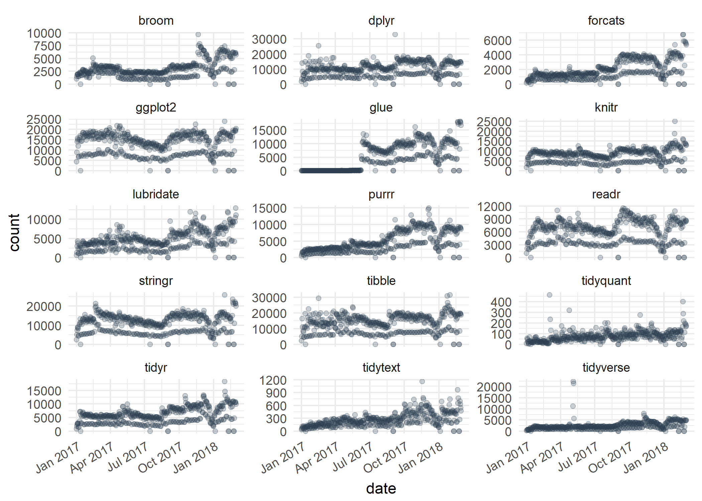
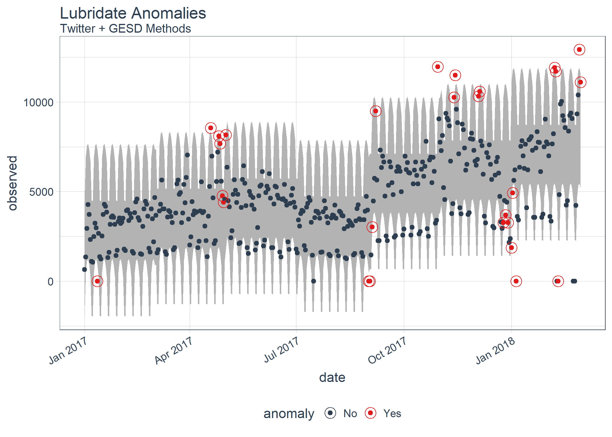
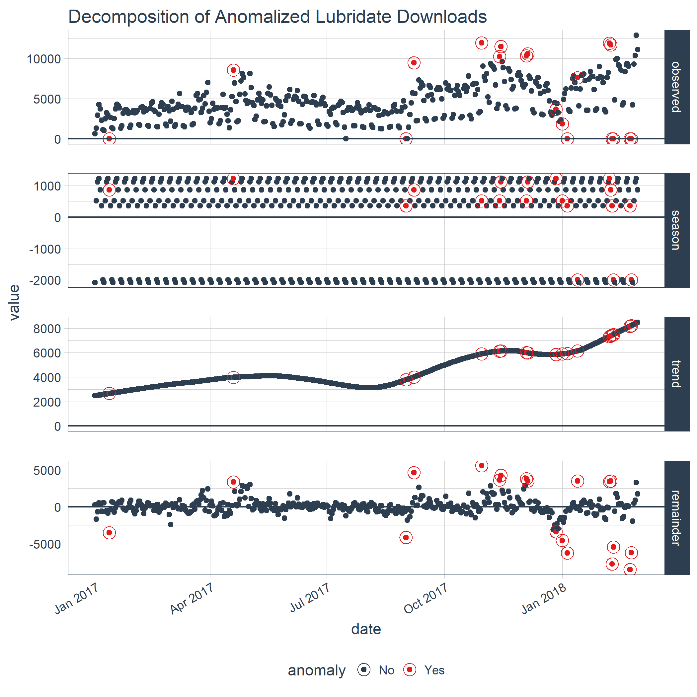

<!-- README.md is generated from README.Rmd. Please edit that file -->

# anomalize

[](https://travis-ci.org/business-science/anomalize)
[](https://codecov.io/github/business-science/anomalize?branch=master)

> Tidy anomaly detection

`anomalize` enables a tidy workflow for detecting anomalies in data. The
main functions are `time_decompose()`, `anomalize()`, and
`time_recompose()`. When combined, it’s quite simple to decompose time
series, detect anomalies, and create bands separating the “normal” data
from the anomalous
data.

<!-- ## Benefits -->

<!-- With `anomalize` you can: -->

<!-- - Perform anomaly detection on grouped data -->

<!-- - Get bands that separates the "normal" data from the anomalies! -->

<!-- - Implement the best decomposition techniques including Seasonal Decomposition (STL), Twitter AnomalyDetection, and Multiplicative Decomposition -->

<!-- - Use two outlier detection methods including IQR (fast and reliable) and GESD (best performance) -->

<!-- - Visualize:  -->

<!--     - Time series decomposition on a single time series, which is useful for seeing the affects of the parameters -->

<!--     - Anomaly detection on many time series (grouped in one data frame) -->

<!-- Let's check `anomalize` out! -->

## Installation

<!-- You can install the released version of anomalize from [CRAN](https://CRAN.R-project.org) with: -->

You can install the development version with `devtools`:

``` r
devtools::install_github("business-science/anomalize")
```

## How It Works

`anomalize` has three main functions:

  - `time_decompose()`: Separates the time series into seasonal, trend,
    and remainder components
  - `anomalize()`: Applies anomaly detection methods to the remainder
    component.
  - `time_recompose()`: Calculates limits that separate the “normal”
    data from the anomalies\!

## Getting Started

Load the `tidyverse` and `anomalize` packages.

``` r
library(tidyverse)
library(anomalize)
```

Next, let’s get some data. `anomalize` ships with a data set called
`tidyverse_cran_downloads` that contains the daily CRAN download counts
for 15 “tidy” packages from 2017-01-01 to 2018-03-01.

``` r
tidyverse_cran_downloads %>%
    ggplot(aes(date, count)) +
    geom_point(color = "#2c3e50", alpha = 0.25) +
    facet_wrap(~ package, scale = "free_y", ncol = 3) +
    theme_minimal() +
    theme(axis.text.x = element_text(angle = 30, hjust = 1))
```



Suppose we want to determine which daily download “counts” are
anomalous. It’s as easy as using the three main functions
(`time_decompose()`, `anomalize()`, and `time_recompose()`) along with a
visualization function, `plot_anomalies()`.

``` r
tidyverse_cran_downloads %>%
    # Data Manipulation / Anomaly Detection
    time_decompose(count, method = "stl") %>%
    anomalize(remainder, method = "iqr") %>%
    time_recompose() %>%
    # Anomaly Visualization
    plot_anomalies(time_recomposed = TRUE, ncol = 3, alpha_dots = 0.25) +
    labs(title = "Tidyverse Anomalies", subtitle = "STL + IQR Methods") +
    theme(axis.text.x = element_text(angle = 30, hjust = 1))
```


If you’re familiar with Twitter’s `AnomalyDetection` package, you can
implement that method by combining `time_decompose(method = "twitter")`
with `anomalize(method = "gesd")`. Additionally, we’ll adjust the `trend
= "2 months"` to adjust the median spans, which is how Twitter’s
decomposition method works.

``` r
# Get only lubridate downloads
lubridate_dloads <- tidyverse_cran_downloads %>%
    filter(package == "lubridate") %>% 
    ungroup()

# Anomalize!!
lubridate_dloads %>%
    # Twitter + GESD
    time_decompose(count, method = "twitter", trend = "2 months") %>%
    anomalize(remainder, method = "gesd") %>%
    time_recompose() %>%
    # Anomaly Visualziation
    plot_anomalies(time_recomposed = TRUE) +
    labs(title = "Lubridate Anomalies", subtitle = "Twitter + GESD Methods")
```



Last, we can compare to STL + IQR methods, which use different
decomposition and anomaly detection approaches.

``` r
lubridate_dloads %>%
    # STL + IQR Anomaly Detection
    time_decompose(count, method = "stl", trend = "2 months") %>%
    anomalize(remainder, method = "iqr") %>%
    time_recompose() %>%
    # Anomaly Visualization
    plot_anomalies(time_recomposed = TRUE) +
    labs(title = "Lubridate Anomalies", subtitle = "STL + IQR Methods")
```


## But Wait, There’s More\!

There are a several extra capabilities:

  - `time_frequency()` and `time_trend()` for generating frequency and
    trend spans using date and datetime information, which is more
    intuitive than selecting numeric values. Also, `period = "auto"`
    automatically selects frequency and trend spans based on the time
    scale of the data.

<!-- end list -->

``` r
# Time Frequency
time_frequency(lubridate_dloads, period = "auto")
#> frequency = 7 days
#> [1] 7
```

``` r
# Time Trend
time_trend(lubridate_dloads, period = "auto")
#> trend = 91 days
#> [1] 91
```

  - `plot_anomaly_decomposition()` for visualizing the inner workings of
    how algorithm detects anomalies in the “remainder”.

<!-- end list -->

``` r
tidyverse_cran_downloads %>%
    filter(package == "lubridate") %>%
    ungroup() %>%
    time_decompose(count) %>%
    anomalize(remainder) %>%
    plot_anomaly_decomposition() +
    labs(title = "Decomposition of Anomalized Lubridate Downloads")
```



<!-- - Other `time_decompose` methods: In addition to "stl" and "twitter", we have added "multiplicative" for time series with non-constant variance. Word of caution that statistical transformations such as logarithmic or power transformations may perform better. -->

  - Vector functions for anomaly detection: `iqr()` and `gesd()`. These
    are great for just using on numeric data. Note that trend and
    seasonality should already be removed for time series data.

<!-- end list -->

``` r
# Data with outliers
set.seed(100)
x <- rnorm(100)
idx_outliers <- sample(100, size = 5)
x[idx_outliers] <- x[idx_outliers] + 10

# IQR method
iqr(x, alpha = 0.05, max_anoms = 0.2)
#>   [1] "No"  "No"  "No"  "No"  "No"  "No"  "No"  "No"  "No"  "No"  "No" 
#>  [12] "No"  "No"  "No"  "No"  "No"  "No"  "No"  "No"  "No"  "No"  "No" 
#>  [23] "No"  "No"  "No"  "No"  "No"  "No"  "No"  "No"  "Yes" "No"  "No" 
#>  [34] "No"  "No"  "No"  "Yes" "No"  "No"  "No"  "No"  "No"  "No"  "No" 
#>  [45] "No"  "No"  "No"  "No"  "No"  "No"  "No"  "No"  "No"  "No"  "No" 
#>  [56] "No"  "No"  "No"  "No"  "No"  "No"  "No"  "No"  "No"  "No"  "No" 
#>  [67] "No"  "No"  "No"  "No"  "No"  "No"  "No"  "No"  "No"  "No"  "No" 
#>  [78] "No"  "No"  "Yes" "No"  "No"  "No"  "No"  "No"  "No"  "No"  "No" 
#>  [89] "No"  "Yes" "No"  "No"  "No"  "No"  "Yes" "No"  "No"  "No"  "No" 
#> [100] "No"
```

  - Anomaly Reports: Using `verbose = TRUE`, we can return a nice report
    of useful information related to the outliers.

<!-- end list -->

``` r
lubridate_dloads %>%
    time_decompose(count) %>%
    anomalize(remainder, verbose = TRUE)
#> $anomalized_tbl
#> # A time tibble: 425 x 8
#> # Index: date
#>    date       observed season trend remainder remainder_l1 remainder_l2
#>    <date>        <dbl>  <dbl> <dbl>     <dbl>        <dbl>        <dbl>
#>  1 2017-01-01     643. -2078. 2474.      246.       -3323.        3310.
#>  2 2017-01-02    1350.   518. 2491.    -1659.       -3323.        3310.
#>  3 2017-01-03    2940.  1117. 2508.     -685.       -3323.        3310.
#>  4 2017-01-04    4269.  1220. 2524.      525.       -3323.        3310.
#>  5 2017-01-05    3724.   865. 2541.      318.       -3323.        3310.
#>  6 2017-01-06    2326.   356. 2558.     -588.       -3323.        3310.
#>  7 2017-01-07    1107. -1998. 2574.      531.       -3323.        3310.
#>  8 2017-01-08    1058. -2078. 2591.      545.       -3323.        3310.
#>  9 2017-01-09    2494.   518. 2608.     -632.       -3323.        3310.
#> 10 2017-01-10    3237.  1117. 2624.     -504.       -3323.        3310.
#> # ... with 415 more rows, and 1 more variable: anomaly <chr>
#> 
#> $anomaly_details
#> $anomaly_details$outlier
#>   [1] "No"  "No"  "No"  "No"  "No"  "No"  "No"  "No"  "No"  "No"  "No" 
#>  [12] "Yes" "No"  "No"  "No"  "No"  "No"  "No"  "No"  "No"  "No"  "No" 
#>  [23] "No"  "No"  "No"  "No"  "No"  "No"  "No"  "No"  "No"  "No"  "No" 
#>  [34] "No"  "No"  "No"  "No"  "No"  "No"  "No"  "No"  "No"  "No"  "No" 
#>  [45] "No"  "No"  "No"  "No"  "No"  "No"  "No"  "No"  "No"  "No"  "No" 
#>  [56] "No"  "No"  "No"  "No"  "No"  "No"  "No"  "No"  "No"  "No"  "No" 
#>  [67] "No"  "No"  "No"  "No"  "No"  "No"  "No"  "No"  "No"  "No"  "No" 
#>  [78] "No"  "No"  "No"  "No"  "No"  "No"  "No"  "No"  "No"  "No"  "No" 
#>  [89] "No"  "No"  "No"  "No"  "No"  "No"  "No"  "No"  "No"  "No"  "No" 
#> [100] "No"  "No"  "No"  "No"  "No"  "No"  "No"  "No"  "No"  "Yes" "No" 
#> [111] "No"  "No"  "No"  "No"  "No"  "No"  "No"  "No"  "No"  "No"  "No" 
#> [122] "No"  "No"  "No"  "No"  "No"  "No"  "No"  "No"  "No"  "No"  "No" 
#> [133] "No"  "No"  "No"  "No"  "No"  "No"  "No"  "No"  "No"  "No"  "No" 
#> [144] "No"  "No"  "No"  "No"  "No"  "No"  "No"  "No"  "No"  "No"  "No" 
#> [155] "No"  "No"  "No"  "No"  "No"  "No"  "No"  "No"  "No"  "No"  "No" 
#> [166] "No"  "No"  "No"  "No"  "No"  "No"  "No"  "No"  "No"  "No"  "No" 
#> [177] "No"  "No"  "No"  "No"  "No"  "No"  "No"  "No"  "No"  "No"  "No" 
#> [188] "No"  "No"  "No"  "No"  "No"  "No"  "No"  "No"  "No"  "No"  "No" 
#> [199] "No"  "No"  "No"  "No"  "No"  "No"  "No"  "No"  "No"  "No"  "No" 
#> [210] "No"  "No"  "No"  "No"  "No"  "No"  "No"  "No"  "No"  "No"  "No" 
#> [221] "No"  "No"  "No"  "No"  "No"  "No"  "No"  "No"  "No"  "No"  "No" 
#> [232] "No"  "No"  "No"  "No"  "No"  "No"  "No"  "No"  "No"  "No"  "No" 
#> [243] "No"  "Yes" "No"  "No"  "No"  "No"  "No"  "Yes" "No"  "No"  "No" 
#> [254] "No"  "No"  "No"  "No"  "No"  "No"  "No"  "No"  "No"  "No"  "No" 
#> [265] "No"  "No"  "No"  "No"  "No"  "No"  "No"  "No"  "No"  "No"  "No" 
#> [276] "No"  "No"  "No"  "No"  "No"  "No"  "No"  "No"  "No"  "No"  "No" 
#> [287] "No"  "No"  "No"  "No"  "No"  "No"  "No"  "No"  "No"  "No"  "No" 
#> [298] "No"  "No"  "No"  "No"  "No"  "Yes" "No"  "No"  "No"  "No"  "No" 
#> [309] "No"  "No"  "No"  "No"  "No"  "No"  "No"  "No"  "Yes" "Yes" "No" 
#> [320] "No"  "No"  "No"  "No"  "No"  "No"  "No"  "No"  "No"  "No"  "No" 
#> [331] "No"  "No"  "No"  "No"  "No"  "No"  "No"  "Yes" "Yes" "No"  "No" 
#> [342] "No"  "No"  "No"  "No"  "No"  "No"  "No"  "No"  "No"  "No"  "No" 
#> [353] "No"  "No"  "No"  "No"  "No"  "No"  "No"  "No"  "Yes" "No"  "No" 
#> [364] "No"  "No"  "Yes" "No"  "No"  "No"  "Yes" "No"  "No"  "No"  "No" 
#> [375] "No"  "No"  "No"  "Yes" "No"  "No"  "No"  "No"  "No"  "No"  "No" 
#> [386] "No"  "No"  "No"  "No"  "No"  "No"  "No"  "No"  "No"  "No"  "No" 
#> [397] "No"  "No"  "No"  "No"  "No"  "No"  "Yes" "Yes" "Yes" "Yes" "No" 
#> [408] "No"  "No"  "No"  "No"  "No"  "No"  "No"  "No"  "No"  "No"  "No" 
#> [419] "Yes" "Yes" "No"  "No"  "No"  "No"  "No" 
#> 
#> $anomaly_details$outlier_idx
#>  [1] 419 405 370 420 303 406 250 366 318 244 338 317  12 378 339 404 403
#> [18] 361 109
#> 
#> $anomaly_details$outlier_vals
#>  [1] -8518.886 -7779.522 -6293.275 -6218.430  5557.429 -5477.838  4619.824
#>  [8] -4553.173  4240.767 -4136.721  3804.789  3626.129 -3522.194  3494.339
#> [15]  3486.598  3477.376  3385.065 -3381.355  3347.284
#> 
#> $anomaly_details$outlier_direction
#>  [1] "Down" "Down" "Down" "Down" "Up"   "Down" "Up"   "Down" "Up"   "Down"
#> [11] "Up"   "Up"   "Down" "Up"   "Up"   "Up"   "Up"   "Down" "Up"  
#> 
#> $anomaly_details$critical_limits
#> limit_lower limit_upper 
#>   -3323.425    3310.268 
#> 
#> $anomaly_details$outlier_report
#> # A tibble: 85 x 7
#>     rank index  value limit_lower limit_upper outlier direction
#>    <dbl> <dbl>  <dbl>       <dbl>       <dbl> <chr>   <chr>    
#>  1    1.  419. -8519.      -3323.       3310. Yes     Down     
#>  2    2.  405. -7780.      -3323.       3310. Yes     Down     
#>  3    3.  370. -6293.      -3323.       3310. Yes     Down     
#>  4    4.  420. -6218.      -3323.       3310. Yes     Down     
#>  5    5.  303.  5557.      -3323.       3310. Yes     Up       
#>  6    6.  406. -5478.      -3323.       3310. Yes     Down     
#>  7    7.  250.  4620.      -3323.       3310. Yes     Up       
#>  8    8.  366. -4553.      -3323.       3310. Yes     Down     
#>  9    9.  318.  4241.      -3323.       3310. Yes     Up       
#> 10   10.  244. -4137.      -3323.       3310. Yes     Down     
#> # ... with 75 more rows
```

## References

Several other packages were instrumental in developing anomaly detection
methods used in `anomalize`:

  - Twitter’s `AnomalyDetection`, which implements decomposition using
    median spans and the Generalized Extreme Studentized Deviation
    (GESD) test for anomalies.
  - `forecast::tsoutliers()` function, which implements the IQR method.
