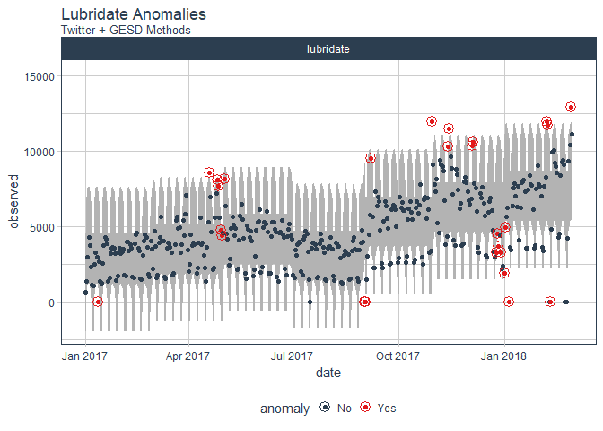
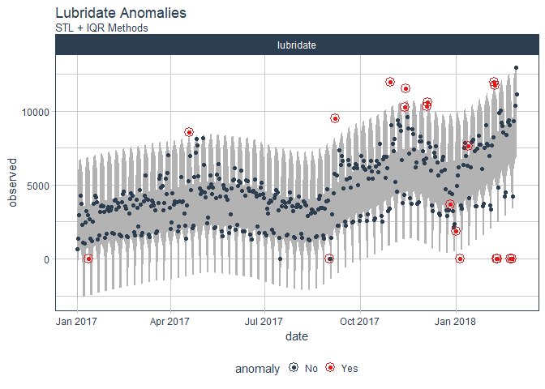

<!-- README.md is generated from README.Rmd. Please edit that file -->

# anomalize

> Tidy anomaly detection

`anomalize` enables a tidy workflow for detecting anomalies in data. The
main functions are `time_decompose()`, `anomalize()`, and
`time_recompose()`. When combined, it’s quite simple to decompose time
series, detect anomalies, and create bands separating the “normal” data
from the anomalous
data.

<!-- ## Benefits -->

<!-- With `anomalize` you can: -->

<!-- - Perform anomaly detection on grouped data -->

<!-- - Get bands that separates the "normal" data from the anomalies! -->

<!-- - Implement the best decomposition techniques including Seasonal Decomposition (STL), Twitter AnomalyDetection, and Multiplicative Decomposition -->

<!-- - Use two outlier detection methods including IQR (fast and reliable) and GESD (best performance) -->

<!-- - Visualize:  -->

<!--     - Time series decomposition on a single time series, which is useful for seeing the affects of the parameters -->

<!--     - Anomaly detection on many time series (grouped in one data frame) -->

<!-- Let's check `anomalize` out! -->

## Installation

<!-- You can install the released version of anomalize from [CRAN](https://CRAN.R-project.org) with: -->

You can install the development version with `devtools`:

``` r
devtools::install_github("business-science/anomalize")
```

## How It Works

`anomalize` has three main functions:

  - `time_decompose()`: Separates the time series into seasonal, trend,
    and remainder components
  - `anomalize()`: Applies anomaly detection methods to the remainder
    component.
  - `time_recompose()`: Calculates limits that separate the “normal”
    data from the anomalies\!

<!-- end list -->

``` r
library(tidyverse)
library(anomalize)
```

First, let’s get some data. We have a data set called
`tidyverse_cran_downloads` that contains the daily CRAN download counts
for 15 “tidy” packages from 2017-01-01 to 2018-03-01.

``` r
tidyverse_cran_downloads %>%
    ggplot(aes(date, count)) +
    geom_point(color = "#2c3e50", alpha = 0.25) +
    facet_wrap(~ package, scale = "free_y", ncol = 3) +
    theme_minimal() +
    theme(axis.text.x = element_text(angle = 30, hjust = 1))
```


Suppose we want to determine which daily “counts” are anomalous. It’s as
easy as using the three main functions (`time_decompose()`,
`anomalize()`, and `time_recompose()`) along with a visualization
function, `plot_anomalies()`.

``` r
tidyverse_cran_downloads %>%
    time_decompose(count, method = "stl") %>%
    anomalize(remainder, method = "iqr") %>%
    time_recompose() %>%
    plot_anomalies(time_recomposed = TRUE, ncol = 3, alpha_dots = 0.25) +
    labs(title = "Tidyverse Anomalies", subtitle = "STL + IQR Methods") +
    theme(axis.text.x = element_text(angle = 30, hjust = 1))
```


If you’re familiar with Twitter’s `AnomalyDetection` package, you can
implement that method by combining `time_decompose(method = "twitter")`
with `anomalize(method = "gesd")`. Additionally, we’ll adjust the `trend
= "2 months"` to adjust the median spans, which is how Twitter’s
decomposition method works.

``` r
tidyverse_cran_downloads %>%
    filter(package == "lubridate") %>%
    time_decompose(count, method = "twitter", trend = "2 months") %>%
    anomalize(remainder, method = "gesd") %>%
    time_recompose() %>%
    plot_anomalies(time_recomposed = T) +
    labs(title = "Lubridate Anomalies", subtitle = "Twitter + GESD Methods")
```



And, we can compare to STL + IQR methods, which use different
decomposition and anomaly detection approaches.

``` r
tidyverse_cran_downloads %>%
    filter(package == "lubridate") %>%
    time_decompose(count, method = "stl", trend = "2 months") %>%
    anomalize(remainder, method = "iqr") %>%
    time_recompose() %>%
    plot_anomalies(time_recomposed = T) +
    labs(title = "Lubridate Anomalies", subtitle = "STL + IQR Methods")
```



There are a several extra capabilities:

  - `time_frequency()` and `time_trend()` for generating frequency and
    trend spans using date and datetime information, which is more
    intuitive than selecting numeric values. Also, `period = "auto"`
    automatically selects frequency and trend spans based on the time
    scale of the data.

  - `plot_anomaly_decomposition()` for visualizing the inner workings of
    how the “remainder” is analyzed for anomalies.

## References

We investigated several other packages when developing anomaly detection
methods used in `anomalize`:

  - Twitter’s `AnomalyDetection`, which implements decomposition using
    median spans and the Generalized Extreme Studentized Deviation
    (GESD) test for anomalies.
  - `forecast::tsoutliers()` function, which implements the IQR method.
